# 🎯 Claude Agent Orchestration Studio

<div align="center">


**A powerful visual workflow builder for orchestrating AI agents with drag-and-drop functionality**

[Features](#-features) • [Demo](#-quick-demo) • [Installation](#-installation) • [Documentation](#-documentation) • [Contributing](#-contributing)

</div>

---

## 📋 Table of Contents

- [Overview](#-overview)
- [Features](#-features)
- [Architecture](#-architecture)
- [Technology Stack](#-technology-stack)
- [Installation](#-installation)
- [Quick Start](#-quick-start)
- [Workflow Guide](#-workflow-guide)
- [Components](#-components)
- [Development](#-development)
- [Contributing](#-contributing)
- [License](#-license)

---

## 🌟 Overview

**Claude Agent Orchestration Studio** is a modern, intuitive visual platform for building and managing AI-powered workflows. Inspired by OpenAI's AgentKit, it provides a drag-and-drop canvas where you can design complex agent orchestrations, connect multiple AI agents, and automate sophisticated workflows—all without writing code.

### Why Claude Agent Orchestration Studio?

✨ **Visual First** - Design workflows with an intuitive drag-and-drop interface  
🤖 **AI-Powered** - Leverage Claude AI agents for intelligent decision-making  
🔗 **Seamless Integration** - Connect multiple services and APIs effortlessly  
⚡ **Real-time Execution** - Watch your workflows execute with live status updates  
🎨 **Beautiful UI** - Modern, responsive design built with Tailwind CSS and shadcn/ui  

---

## ✨ Features

### Core Capabilities

| Feature | Description | Status |
|---------|-------------|--------|
| 🎨 **Visual Workflow Builder** | Drag-and-drop interface for creating complex workflows | ✅ Active |
| 🔗 **Node Connections** | Create and manage connections between workflow nodes | ✅ Active |
| 🤖 **AI Agent Integration** | Integrate Claude AI agents for intelligent processing | ✅ Active |
| 📊 **Real-time Execution** | Execute workflows with live status tracking | ✅ Active |
| 💾 **Auto-save** | Automatic workflow persistence to backend | ✅ Active |
| 🎯 **Multiple Node Types** | Triggers, Agents, Actions, Logic, and Integrations | ✅ Active |
| 🔍 **Zoom & Pan** | Infinite canvas with smooth navigation controls | ✅ Active |
| 🎭 **Properties Panel** | Configure nodes with detailed property settings | ✅ Active |
| 🌓 **Theme Support** | Light and dark mode with smooth transitions | ✅ Active |
| 📱 **Responsive Design** | Works seamlessly on desktop and tablet devices | ✅ Active |

### Node Types

```mermaid
graph LR
    A[🎯 Triggers] --> B[Start Workflows]
    C[🤖 Agents] --> D[AI Processing]
    E[⚡ Actions] --> F[Execute Tasks]
    G[🔀 Logic] --> H[Control Flow]
    I[🔌 Integrations] --> J[External Services]
    
    style A fill:#10b981
    style C fill:#f97316
    style E fill:#3b82f6
    style G fill:#a855f7
    style I fill:#ec4899
```



---

## 🏗️ Architecture

### System Architecture


### Workflow Execution Flow


### Component Hierarchy


---

## 🛠️ Technology Stack

### Frontend Technologies

| Technology | Version | Purpose |
|------------|---------|---------|
| **React** | 18.2.0 | UI Framework |
| **TypeScript** | 5.7.2 | Type Safety |
| **Vite** | 6.3.1 | Build Tool & Dev Server |
| **Tailwind CSS** | 3.4.1 | Styling Framework |
| **shadcn/ui** | Latest | Component Library |
| **React Router** | 6.22.1 | Routing |
| **Zustand** | 5.0.6 | State Management |
| **React Hook Form** | 7.56.1 | Form Management |
| **Zod** | 3.24.3 | Schema Validation |
| **Lucide React** | 0.503.0 | Icon Library |

### UI Components (Radix UI)

<details>
<summary>Click to expand complete component list</summary>

| Component | Version | Usage |
|-----------|---------|-------|
| Accordion | 1.2.8 | Collapsible content |
| Alert Dialog | 1.1.11 | Modal confirmations |
| Avatar | 1.1.7 | User profiles |
| Checkbox | 1.2.3 | Form inputs |
| Dialog | 1.1.11 | Modal windows |
| Dropdown Menu | 2.1.12 | Context menus |
| Hover Card | 1.1.11 | Info tooltips |
| Label | 2.1.4 | Form labels |
| Popover | 1.1.11 | Floating panels |
| Progress | 1.1.4 | Loading indicators |
| Radio Group | 1.3.4 | Option selection |
| Scroll Area | 1.2.6 | Custom scrollbars |
| Select | 2.2.2 | Dropdown selects |
| Slider | 1.3.2 | Range inputs |
| Switch | 1.2.2 | Toggle switches |
| Tabs | 1.1.9 | Tab navigation |
| Toast | 1.2.11 | Notifications |
| Tooltip | 1.2.4 | Hover hints |

</details>

### Development Tools

| Tool | Version | Purpose |
|------|---------|---------|
| **ESLint** | 9.22.0 | Code Linting |
| **TypeScript ESLint** | 8.26.1 | TS Linting Rules |
| **PostCSS** | 8.5.3 | CSS Processing |
| **Autoprefixer** | 10.4.21 | CSS Vendor Prefixes |

---

## 📦 Installation

### Prerequisites

Before you begin, ensure you have one of the following installed:

- **Node.js** (v18.0.0 or higher)
- **npm** (v9.0.0 or higher) or **bun** (recommended for faster installation)

### Installation Steps

1. **Clone the repository**

```bash
git clone https://github.com/Yash-Kavaiya/Claude-Agent-Orchestration-Studio.git
cd Claude-Agent-Orchestration-Studio
```

2. **Install dependencies**

```bash
# Using bun (recommended - 10x faster)
bun install

# Or using npm
npm install
```

3. **Start development server**

```bash
# Using bun
bun dev

# Or using npm
npm run dev
```

4. **Open your browser**

Navigate to [http://localhost:5173](http://localhost:5173)

### Build for Production

```bash
# Using bun
bun run build

# Or using npm
npm run build
```

The production build will be created in the `dist` directory.

### Preview Production Build

```bash
# Using bun
bun run preview

# Or using npm
npm run preview
```

---

## 🚀 Quick Start

### Creating Your First Workflow


### Step-by-Step Guide

1. **Create a New Workflow**
   - Click "**+ New Workflow**" in the left sidebar
   - Canvas will reset and be ready for your design

2. **Add a Trigger Node**
   - Drag "**Webhook Trigger**" from the sidebar
   - Drop it onto the canvas
   - This will be your workflow's entry point

3. **Add an AI Agent**
   - Drag "**Claude Agent**" from the sidebar
   - Position it next to the trigger

4. **Add an Action Node**
   - Drag "**Database Query**" or any action
   - Place it after the agent

5. **Connect the Nodes**
   - Click and drag from the **right circle** (output) of the Trigger
   - Drop onto the **left circle** (input) of the Agent
   - Repeat to connect Agent to Action

6. **Configure and Execute**
   - Click on each node to configure properties
   - Click "**Execute**" button to run your workflow

### Example Workflow

```mermaid
graph LR
    A[🎯 Webhook Trigger<br/>HTTP POST] --> B[🤖 Claude Agent<br/>Process Request]
    B --> C[⚡ Database Query<br/>Save Data]
    B --> D[⚡ Send Email<br/>Notify User]
    
    style A fill:#10b981,color:#fff
    style B fill:#f97316,color:#fff
    style C fill:#3b82f6,color:#fff
    style D fill:#3b82f6,color:#fff
```



---

## 📖 Workflow Guide

### Node Types and Usage

#### 🎯 Triggers
Start your workflow with an event or scheduled action.

| Trigger Type | Description | Use Case |
|--------------|-------------|----------|
| **Webhook** | HTTP endpoint trigger | API integrations |
| **Schedule** | Time-based trigger | Periodic tasks |
| **Manual** | User-initiated trigger | On-demand execution |
| **File Upload** | File-based trigger | Document processing |

#### 🤖 Agents
AI-powered processing nodes for intelligent decision-making.

| Agent Type | Description | Use Case |
|------------|-------------|----------|
| **Claude Agent** | General-purpose AI | Text processing, analysis |
| **Code Interpreter** | Execute code snippets | Data transformation |
| **Vision Agent** | Image analysis | Visual content processing |
| **Research Agent** | Web search & research | Information gathering |

#### ⚡ Actions
Execute specific tasks and operations.

| Action Type | Description | Use Case |
|-------------|-------------|----------|
| **Database Query** | CRUD operations | Data persistence |
| **API Call** | HTTP requests | External integrations |
| **Send Email** | Email notifications | User communication |
| **File Operation** | File read/write | Document handling |

#### 🔀 Logic
Control workflow execution flow.

| Logic Type | Description | Use Case |
|------------|-------------|----------|
| **Condition** | If/else branching | Decision making |
| **Loop** | Iterate over data | Batch processing |
| **Merge** | Combine multiple inputs | Data aggregation |
| **Split** | Parallel execution | Concurrent tasks |

### Connection Management

#### Creating Connections
- Click and drag from **output handle** (right circle)
- Drop onto **input handle** (left circle)
- Visual feedback shows connection preview

#### Deleting Connections
- Hold `Shift` or `Ctrl`
- Click on the connection line
- Connection removed instantly

### Canvas Controls

#### Zoom Controls (Top Left)
| Control | Action | Shortcut |
|---------|--------|----------|
| **+** | Zoom in | - |
| **-** | Zoom out | - |
| **Maximize** | Reset view | - |
| **Percentage** | Current zoom level | - |

#### Execution Controls (Top Right)
| Control | Action | Status |
|---------|--------|--------|
| **Execute** | Start workflow | Green button |
| **Stop** | Halt execution | Red button |

---

## 🧩 Components

### Component Architecture


### Key Components

| Component | Path | Purpose |
|-----------|------|---------|
| **App.tsx** | `/src/App.tsx` | Main application component |
| **AuthScreen** | `/src/components/AuthScreen.tsx` | Authentication UI |
| **PlatformLayout** | `/src/components/PlatformLayout.tsx` | Main layout wrapper |
| **WorkflowCanvas** | `/src/components/WorkflowCanvas.tsx` | Visual workflow builder |
| **PropertiesPanel** | `/src/components/PropertiesPanel.tsx` | Node configuration |
| **Sidebar** | `/src/components/Sidebar.tsx` | Component library |

---

## 💻 Development

### Project Structure

```
Claude-Agent-Orchestration-Studio/
├── src/
│   ├── components/          # React components
│   │   ├── ui/             # shadcn/ui components
│   │   ├── AuthScreen.tsx  # Authentication
│   │   └── PlatformLayout.tsx
│   ├── pages/              # Page components
│   ├── store/              # Zustand state management
│   ├── hooks/              # Custom React hooks
│   ├── lib/                # Utility functions
│   ├── App.tsx             # Main app component
│   └── main.tsx            # Entry point
├── public/                 # Static assets
├── index.html              # HTML template
├── package.json            # Dependencies
├── tsconfig.json           # TypeScript config
├── vite.config.ts          # Vite configuration
└── tailwind.config.js      # Tailwind CSS config
```

### Available Scripts

| Script | Command | Description |
|--------|---------|-------------|
| **dev** | `npm run dev` | Start development server |
| **build** | `npm run build` | Build for production |
| **lint** | `npm run lint` | Run ESLint |
| **preview** | `npm run preview` | Preview production build |

### Development Server

```bash
# Start development server
npm run dev

# Server will start at:
# Local:   http://localhost:5173
# Network: http://192.168.x.x:5173
```

### Environment Setup

The application uses development mode authentication for easy testing:
- **Email**: Any valid email format
- **OTP**: Any 6-digit code (e.g., `123456`)

### Code Style

This project follows:
- **ESLint** for code linting
- **TypeScript** for type safety
- **Prettier** compatible formatting
- **React** best practices and hooks

### Hot Module Replacement (HMR)

Vite provides instant hot module replacement:
- Changes reflect immediately
- State preservation during updates
- Fast refresh for React components

---

## 🎨 Customization

### Theming

The application supports light and dark modes using `next-themes`:

```typescript
import { useTheme } from "next-themes"

const { theme, setTheme } = useTheme()
setTheme("dark") // or "light"
```

### Tailwind Configuration

Customize colors, spacing, and more in `tailwind.config.js`:

```javascript
module.exports = {
  theme: {
    extend: {
      colors: {
        primary: {...},
        secondary: {...},
      },
    },
  },
}
```

---

## 🤝 Contributing

We welcome contributions! Please follow these steps:

1. **Fork the repository**
2. **Create a feature branch** (`git checkout -b feature/amazing-feature`)
3. **Commit your changes** (`git commit -m 'Add amazing feature'`)
4. **Push to the branch** (`git push origin feature/amazing-feature`)
5. **Open a Pull Request**

### Contribution Guidelines

- Follow the existing code style
- Write meaningful commit messages
- Add tests for new features
- Update documentation as needed
- Ensure all tests pass before submitting

---

## 📝 License

This project is licensed under the MIT License - see the [LICENSE](LICENSE) file for details.

---

## 🙏 Acknowledgments

- **Claude AI** by Anthropic for intelligent agent capabilities
- **shadcn/ui** for beautiful UI components
- **Radix UI** for accessible component primitives
- **Tailwind CSS** for utility-first styling
- **React Flow** for workflow visualization
- **Vite** for lightning-fast development experience

---

## 📞 Support

- **Documentation**: [WORKFLOW_GUIDE.md](WORKFLOW_GUIDE.md)
- **Issues**: [GitHub Issues](https://github.com/Yash-Kavaiya/Claude-Agent-Orchestration-Studio/issues)
- **Discussions**: [GitHub Discussions](https://github.com/Yash-Kavaiya/Claude-Agent-Orchestration-Studio/discussions)

---

<div align="center">

**Built with ❤️ by the Claude Agent Orchestration Studio Team**

[⬆ Back to Top](#-claude-agent-orchestration-studio)

</div>
